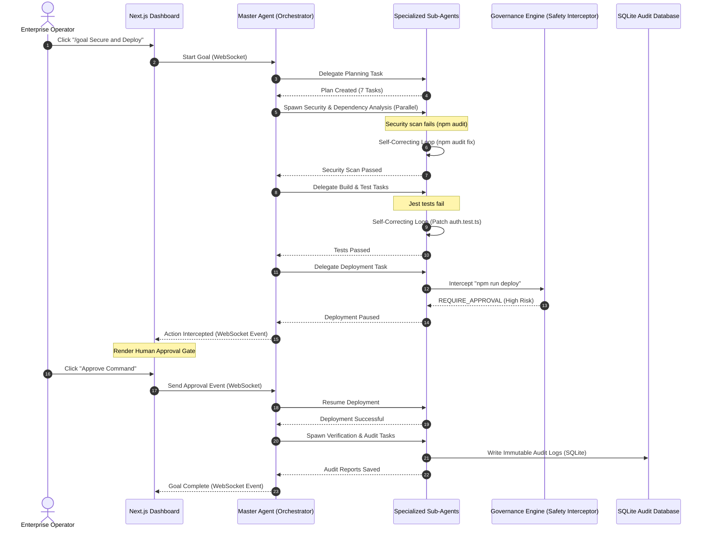
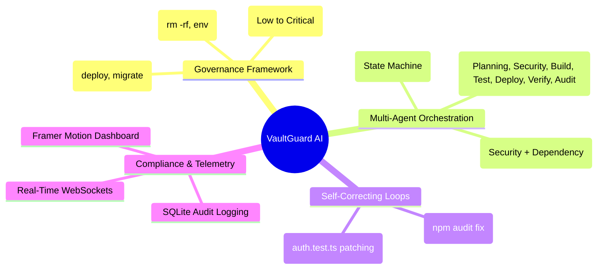
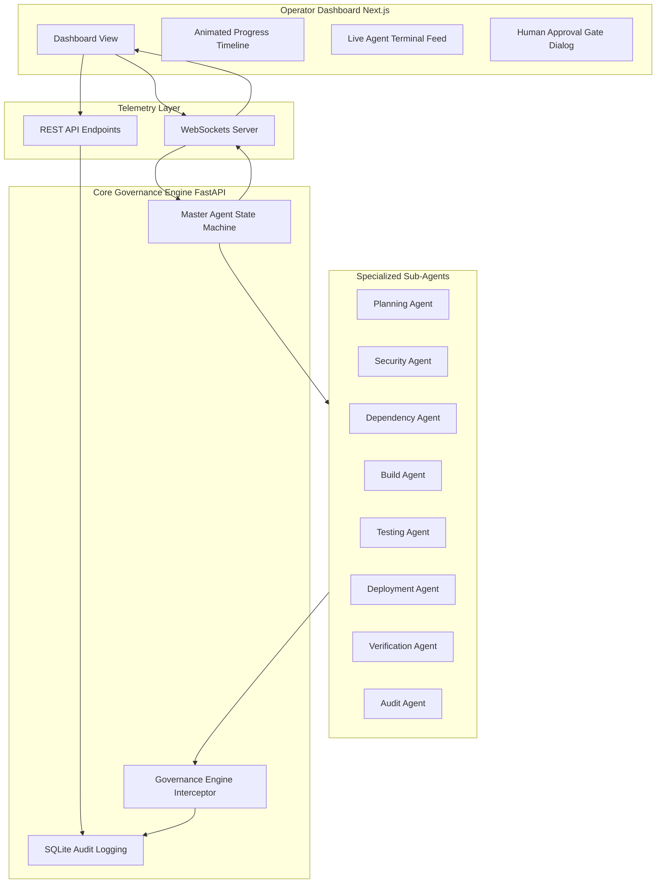
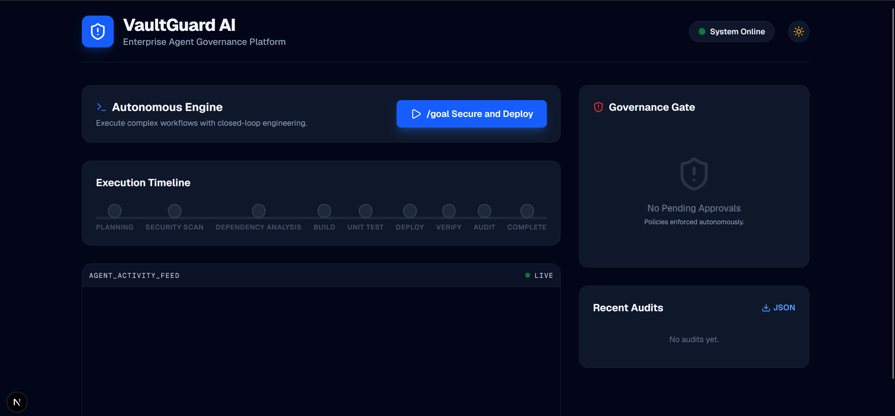
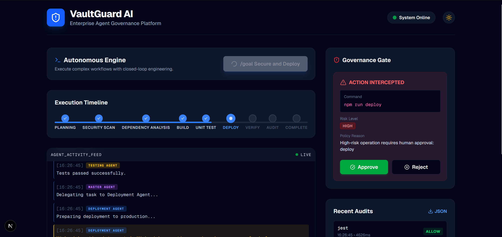
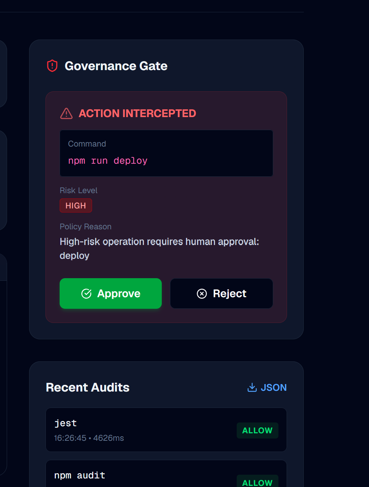
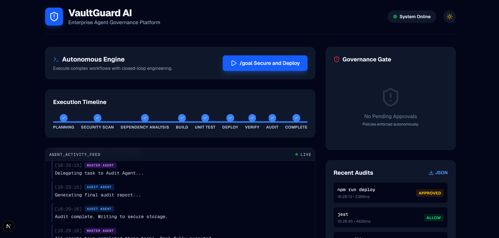
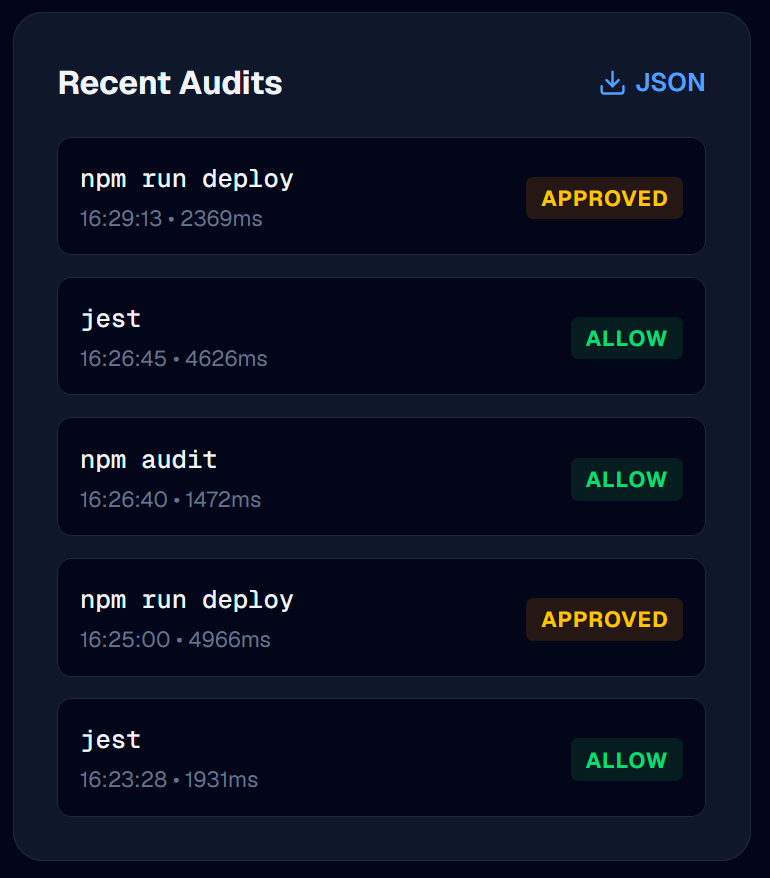

# 🛡️ VaultGuard AI

### **Enterprise Agent Governance & Safety Control Platform**

[](https://github.com)
[](https://github.com)
[](https://github.com)
[](LICENSE)

---

## 📌 Project Overview

**VaultGuard AI** is an enterprise-grade agent governance and safety control platform designed to run, monitor, and regulate autonomous AI agents. Built with **Google Antigravity 2.0**, **Antigravity CLI**, and the **Antigravity SDK**, VaultGuard AI addresses a critical challenge in enterprise adoption: **How do we deploy fully autonomous agents to execute complex, long-running tasks in the background while ensuring they remain secure, compliant, and within organizational policy guardrails?**

Using a declarative governance framework, VaultGuard AI intercepts agent actions (such as shell commands) in real time. It evaluates them against organizational safety rules, automatically denies destructive actions, and routes high-risk tasks through a **Human Approval Gate**. This allows organizations to leverage headless background automation with full confidence and zero compromise on security.

---

## 🚀 Agentic Architect Sprint Alignment

This project was built to address the core challenges of the **Agentic Architect Sprint** under the following categories:

### 1. Topic: Automation & Headless Background Labor
VaultGuard AI operates as a headless background labor platform. It orchestrates a multi-agent software engineering lifecycle (Planning, Auditing, Testing, Building, and Deployment) in the background. By executing complex engineering steps autonomously, it eliminates manual operational bottlenecks. 
*   **Headless Labor**: Agents run independently in background worker threads, executing builds, running tests, and parsing output streams without constant human monitoring.
*   **Time-to-Value (TTV) Optimization**: Tasks are parallelized using asynchronous orchestration to deliver faster execution cycles, cutting down deployment latency.

### 2. Feature: Fully Autonomous Goal Execution (`/goal`)
VaultGuard AI showcases a complete closed-loop execution pattern triggered by a single `/goal Secure and Deploy` command. The engine runs iteratively to achieve this target, utilizing self-correction mechanics to bypass intermediate hurdles:
*   **Self-Correcting Closed-Loop Engineering**: 
    *   **Vulnerability Remediation**: When the `Security Agent` detects a vulnerability during `npm audit`, it doesn't fail; it autonomously executes `npm audit fix` and re-runs the scan to confirm success.
    *   **Auto-Patching Unit Tests**: When the `Testing Agent` encounters a simulated test failure in `auth.test.ts`, it automatically analyzes the test trace, generates a corrective patch, applies it to the codebase, and retries the test suite until it passes.
*   **Outcome Verification**: The goal is only declared complete after a dedicated `Verification Agent` verifies the live health of the service, followed by the `Audit Agent` generating an immutable compliance report.

### 3. Core Theme: Core Architecture & Multi-Agent Orchestration
Rather than relying on a single monolithic prompt, VaultGuard AI uses a hierarchical **Master-Worker** architecture:
*   **Master Agent (Orchestrator)**: Controls a state machine that manages the transitions between stages, handles shared context, and routes execution payloads.
*   **Specialized Sub-agents**: Planning, Security, Dependency, Build, Testing, Deployment, Verification, and Audit agents.
*   **Parallel Subagent Execution**: During the analysis phase, the Master Agent spawns the `Security Agent` and `Dependency Agent` in parallel using async concurrency (`asyncio.gather`), demonstrating how parallel agent executions reduce execution latency without sacrificing system readability.

### 4. Core Theme: Dynamic Subagents & Shared Agent Harness
*   **Shared Agent Harness**: Every specialized agent inherits from a unified `BaseAgent` structure, sharing logging telemetry, environment access controls, and state reporting.
*   **Out-of-Band Governance Interception**: All commands generated by agents pass through the `GovernanceEngine` before execution. It acts as an out-of-band policy control plane, matching commands against declarative policy classes:
    *   `ALLOW`: Non-disruptive commands (e.g. `npm audit`, `npm run build`).
    *   `REQUIRE_APPROVAL`: High-risk operations (e.g. `deploy`, `migrate`, `kubectl apply`).
    *   `DENY`: Malicious or catastrophic actions (e.g. `rm -rf /`, `cat .env`).

---

## 📊 System Architecture & Telemetry Flow

The following diagram illustrates the multi-agent orchestration, the out-of-band governance gate, and the real-time telemetry stream between the backend and the Next.js frontend:



### 🗺️ System Mindmap

This mindmap outlines the functional domains and responsibilities managed by VaultGuard AI:



### 🏛️ High-Level Architectural View

The structural relationship between the operator UI, telemetry communication layer, core engine, and worker agents:



---

## 🛠️ Codebase Structure

The project is structured cleanly into backend (FastAPI, SQLite, State Machine) and frontend (Next.js, TailwindCSS, Framer Motion) directories:

```bash
venguardsprint/
├── backend/
│   ├── database/
│   │   └── models.py          # SQLAlchemy models for SQLite Audit Logging
│   ├── engine/
│   │   ├── agents.py          # BaseAgent & specialized sub-agents implementations
│   │   ├── governance.py      # Declarative Governance Engine & safety rules
│   │   └── state_machine.py   # State machine orchestrating the /goal lifecycle
│   ├── main.py                # FastAPI server, WebSockets endpoints, REST API
│   ├── Dockerfile             # Container configuration for Backend
│   └── requirements.txt       # Python dependencies
├── frontend/
│   ├── src/app/
│   │   ├── page.tsx           # Execution Dashboard & Governance Control Panel
│   │   ├── globals.css        # Tailwind and layout styling
│   │   └── layout.tsx         # Next.js global layout
│   ├── Dockerfile             # Container configuration for Frontend
│   └── package.json           # Node.js dependencies
└── docker-compose.yml         # Local orchestration of services
```

### 📂 Key Source Code Links
*   [backend/main.py](file:///C:/Users/mrmoh/Desktop/venguardsprint/backend/main.py) — FastAPI routing and websocket event handlers.
*   [backend/engine/state_machine.py](file:///C:/Users/mrmoh/Desktop/venguardsprint/backend/engine/state_machine.py) — Master Agent orchestrator driving state transitions and parallel executions.
*   [backend/engine/agents.py](file:///C:/Users/mrmoh/Desktop/venguardsprint/backend/engine/agents.py) — Definitions of the 8 specialized agents and their self-correcting closed-loop workflows.
*   [backend/engine/governance.py](file:///C:/Users/mrmoh/Desktop/venguardsprint/backend/engine/governance.py) — Policy checking rules and command inspection intercepts.
*   [backend/database/models.py](file:///C:/Users/mrmoh/Desktop/venguardsprint/backend/database/models.py) — Relational models for logging agent execution metrics.
*   [frontend/src/app/page.tsx](file:///C:/Users/mrmoh/Desktop/venguardsprint/frontend/src/app/page.tsx) — Real-time interactive UI with agent activity logs, progress timeline, and approval prompts.

---

## ⚡ Setup & Installation

### Option A: Running with Docker (Recommended)
Ensure Docker and Docker Compose are installed on your system.

1.  **Build and start the containers**:
    ```bash
    docker-compose up --build
    ```
2.  **Access the applications**:
    *   **Frontend Dashboard**: [http://localhost:3000](http://localhost:3000)
    *   **Backend API**: [http://localhost:8000](http://localhost:8000) (Note: Frontend connects via websockets to backend port)

---

### Option B: Running Manually

#### 1. Backend Setup
Make sure you have Python 3.11+ installed.
```bash
cd backend
python -m venv venv
# On Windows:
.\venv\Scripts\activate
# On Linux/macOS:
source venv/bin/activate

pip install -r requirements.txt
uvicorn main:app --reload --host 127.0.0.1 --port 8001
```
*(Note: If running manually, ensure the backend runs on port **8001** to match the frontend WebSocket config).*

#### 2. Frontend Setup
Make sure you have Node.js 18+ installed.
```bash
cd frontend
npm install
npm run dev
```
Open [http://localhost:3000](http://localhost:3000) to view the dashboard.

---

## 📺 Demonstration & Walkthrough

Refer to [docs/demo_script.md](docs/demo_script.md) for a step-by-step presentation script designed for the sprint judges. Below is the visual representation of the execution flow.

### 🎥 Recorded Video Demo

Watch the full system execution, including parallel subagent processing, self-healing closed loops, and the human approval gate in action:

<video src="screenshots/venguardvideo.mp4" controls width="100%" poster="screenshots/vemgard1.png">
  Your browser does not support the video tag. Watch the video directly: <a href="screenshots/venguardvideo.mp4">screenshots/venguardvideo.mp4</a>
</video>

---

### 📸 Step-by-Step Execution Gallery

#### 1. Initial State (System Online)
The operator opens the dashboard. The frontend connects to the FastAPI backend via WebSockets. The system displays a status of **System Online** and is ready to accept a `/goal` instruction.


#### 2. Planning & Parallel Execution
Upon clicking **`/goal Secure and Deploy`**, the Master Agent creates a 7-task plan and launches the **Security Agent** and **Dependency Agent** in parallel to inspect packages and map project structures.


#### 3. Closed-Loop Self-Correction
During the scan, the Security Agent encounters a package vulnerability. Rather than failing, it automatically triggers `npm audit fix` and re-scans the repository. Similarly, when unit tests fail, the Testing Agent patches `auth.test.ts` autonomously to restore compliance.


#### 4. Governance Interception & Human Gate
As the flow moves to the deployment phase, the Deployment Agent attempts to run `"npm run deploy"`. The **Governance Engine** intercepts the command as a high-risk operation, pauses execution, and renders an interactive **Governance Gate** modal on the dashboard for the operator.


#### 5. Verification & Immutable Audit Logs
Once the operator clicks **Approve**, the deployment proceeds. The Verification Agent confirms the service's health, and the Audit Agent saves a complete execution trace (actions, risks, decisions, and approvals) to the database, marking the goal as **COMPLETE**.


---

## 📄 License
This project is licensed under the MIT License - see the LICENSE file for details.
