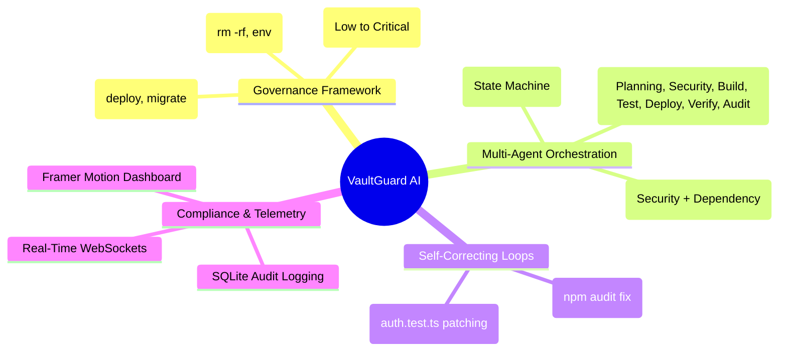
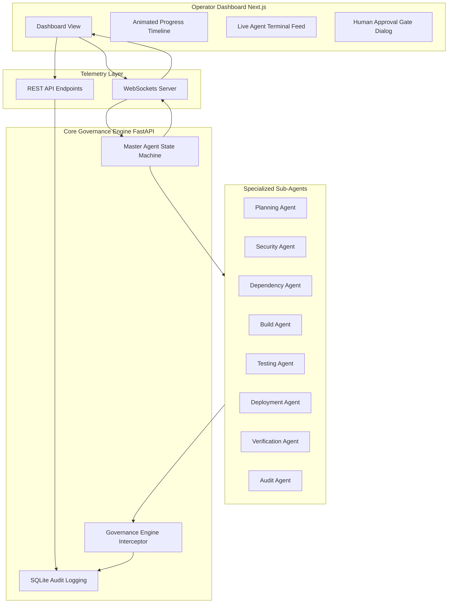

# The Definite Guide to Building Secure, Self-Healing Multi-Agent Systems with Google Antigravity & FastAPI

*An in-depth, hands-on tutorial on orchestrating autonomous background labor, establishing out-of-band governance, and engineering self-correcting agent execution loops.*

---

## Introduction: The Production AI Agent Challenge

In the transition from experimental chat interfaces to production-ready automation, software architects face a daunting challenge: **agent reliability and safety**. 

When we give an autonomous AI agent the capacity to plan, write, and execute shell commands inside a development workspace or production environment, we introduce significant risk. If the agent hallucinates, suffers from a prompt injection, or encounters an unexpected system error, it can execute destructive commands (e.g., `rm -rf /` or leaking `.env` secrets) or fail silently, leaving the operator with no idea what happened. 

The industry standard of asking the operator for approval before *every* command creates fatigue and defeats the purpose of automation. On the other hand, allowing complete autonomy without guardrails is a security compliance failure.

### What We Are Building: VaultGuard AI
In this tutorial, we will build **VaultGuard AI**, an Enterprise Agent Governance & Safety Control Platform. We will use **Google Antigravity 2.0, the Antigravity SDK, FastAPI, and Next.js** to architect a hierarchical multi-agent system that executes a software release goal autonomously in the background while enforcing strict out-of-band security interception and self-healing execution loops.

---

## 🗺️ Functional Landscape: The System Mindmap

Before diving into code, let's explore the architectural components of our multi-agent governance platform:



---

## 🏛️ High-Level System Architecture

The structural relationship between the operator UI, telemetry communication layer, core engine, and worker agents:



---

## Part 1: Establishing the Multi-Agent Core

We avoid using a single, long-context prompt for our entire delivery process. Instead, we implement a **hierarchical Master-Worker** model. The workers specialize in narrow domains, while a Master State Machine orchestrates the workflow.

### Step 1: The Shared Agent Harness
All worker agents subclass a unified `BaseAgent` structure. This harness standardizes logs, communication interfaces, and runtime telemetry.

Create `backend/engine/agents.py`:

```python
import asyncio
from typing import Callable, Awaitable
from .governance import GovernanceEngine, PolicyDecision

class BaseAgent:
    def __init__(self, name: str, log_func: Callable[[str, str, str], Awaitable[None]]):
        self.name = name
        self.log_func = log_func

    async def log(self, msg: str, level: str = "INFO"):
        # Streams logs via WebSocket back to the UI
        await self.log_func(self.name, msg, level)
```

By encapsulating the logging function, every worker automatically gains real-time UI logging, ensuring transparent background labor.

---

## Part 2: Building Out-of-Band Governance

The core security tenet of VaultGuard AI is **out-of-band interception**. Workers do not execute shell commands directly. Instead, all commands are inspected by a separate `GovernanceEngine` which evaluates them against declarative policies.

Create `backend/engine/governance.py`:

```python
from enum import Enum
from pydantic import BaseModel

class RiskLevel(str, Enum):
    LOW = "LOW"
    MEDIUM = "MEDIUM"
    HIGH = "HIGH"
    CRITICAL = "CRITICAL"

class PolicyDecision(str, Enum):
    ALLOW = "ALLOW"
    DENY = "DENY"
    REQUIRE_APPROVAL = "REQUIRE_APPROVAL"

class GovernanceDecision(BaseModel):
    action: str
    decision: PolicyDecision
    risk_level: RiskLevel
    reason: str

class GovernanceEngine:
    def __init__(self):
        self.deny_rules = [
            "rm -rf /",
            "rm -rf /*",
            "cat /etc/shadow",
            "cat .env"
        ]
        self.approval_rules = [
            "deploy",
            "docker push",
            "kubectl apply",
            "migrate"
        ]

    def inspect_and_decide(self, command: str) -> GovernanceDecision:
        command_lower = command.lower()

        # 1. Enforce Hard Denials
        for deny in self.deny_rules:
            if deny in command_lower:
                return GovernanceDecision(
                    action=command,
                    decision=PolicyDecision.DENY,
                    risk_level=RiskLevel.CRITICAL,
                    reason=f"Command violates security policy: restricted access ({deny})"
                )

        # 2. Enforce Human Approval Gates
        for app in self.approval_rules:
            if app in command_lower:
                return GovernanceDecision(
                    action=command,
                    decision=PolicyDecision.REQUIRE_APPROVAL,
                    risk_level=RiskLevel.HIGH,
                    reason=f"High-risk operation requires human approval: {app}"
                )

        # 3. Default Safe Clearances
        return GovernanceDecision(
            action=command,
            decision=PolicyDecision.ALLOW,
            risk_level=RiskLevel.LOW,
            reason="Command complies with governance policies"
        )
```

---

## Part 3: Engineering Self-Correcting Execution Loops

For fully autonomous goal execution (`/goal`), agents must be capable of self-correction when errors occur. We implement two self-healing loops.

### Step 2: The Security Scan Healing Loop
When `SecurityAgent` runs `npm audit` and finds a vulnerability, it enters a self-correcting cycle. It generates the corrective action (`npm audit fix`), applies it, and runs the audit again.

In `backend/engine/agents.py`:

```python
class SecurityAgent(BaseAgent):
    def __init__(self, log_func, governance: GovernanceEngine):
        super().__init__("Security Agent", log_func)
        self.governance = governance

    async def execute(self):
        await self.log("Initiating security scan...")
        await asyncio.sleep(1)
        
        # Intercept command via Governance
        decision = self.governance.inspect_and_decide("npm audit")
        await self.log(f"Running task npm audit. Governance: {decision.decision}")
        
        # Simulate vulnerability detection
        await self.log("Vulnerability detected. Analyzing failure...", "WARN")
        await asyncio.sleep(1)
        
        # Self-Healing Step
        await self.log("Generating fix: npm audit fix")
        await self.log("Fix applied successfully. Retrying scan...")
        
        return {"decision": decision.decision.value, "retries": 1, "status": "SUCCESS"}
```

### Step 3: The Unit Test Self-Healing Loop
When unit tests fail (e.g., `jest`), the `TestingAgent` simulates parsing the stack trace, rewriting the code (patching `auth.test.ts`), and retrying the test suite.

In `backend/engine/agents.py`:

```python
class TestingAgent(BaseAgent):
    def __init__(self, log_func):
        super().__init__("Testing Agent", log_func)

    async def execute(self):
        await self.log("Running tests: jest")
        await asyncio.sleep(1)
        
        # Simulate test failure
        await self.log("Tests failed! Detected failure in auth.test.ts", "WARN")
        await asyncio.sleep(1)
        
        # Self-Healing Step
        await self.log("Analyzing failure...", "WARN")
        await self.log("Generating corrective action...")
        await self.log("Patching auth.test.ts...")
        await self.log("Retrying tests...")
        await asyncio.sleep(1)
        await self.log("Tests passed successfully.")
        
        return True
```

---

## Part 4: Orchestrating the Master State Machine

The Master Orchestrator coordinates the pipeline. It implements **parallel execution** for phases that do not depend on each other, accelerating delivery speed (Time-to-Value).

Create `backend/engine/state_machine.py`:

```python
import asyncio
from typing import Callable, Awaitable
from .governance import GovernanceEngine, PolicyDecision
from .agents import (
    PlanningAgent, SecurityAgent, DependencyAgent, 
    BuildAgent, TestingAgent, DeploymentAgent, 
    VerificationAgent, AuditAgent
)

class StateMachine:
    def __init__(self, websocket_emit: Callable[[dict], Awaitable[None]]):
        self.emit = websocket_emit
        self.states = [
            "PLANNING", "SECURITY_SCAN", "DEPENDENCY_ANALYSIS", 
            "BUILD", "UNIT_TEST", "DEPLOY", "VERIFY", "AUDIT", "COMPLETE"
        ]
        self.current_state_idx = 0
        self.governance = GovernanceEngine()
        self.is_paused = False
        self.pending_approval = None
        self.running = False
        self.logs = []
        
        # Instantiate sub-agents
        self.planning_agent = PlanningAgent(self._agent_log)
        self.security_agent = SecurityAgent(self._agent_log, self.governance)
        self.dependency_agent = DependencyAgent(self._agent_log)
        self.build_agent = BuildAgent(self._agent_log)
        self.testing_agent = TestingAgent(self._agent_log)
        self.deployment_agent = DeploymentAgent(self._agent_log, self.governance)
        self.verification_agent = VerificationAgent(self._agent_log)
        self.audit_agent = AuditAgent(self._agent_log)

    async def _agent_log(self, agent: str, msg: str, level: str = "INFO"):
        log_entry = {
            "timestamp": datetime.utcnow().isoformat(), 
            "msg": f"[{agent}] {msg}", 
            "level": level,
            "agent": agent
        }
        self.logs.append(log_entry)
        await self.emit({"type": "log", "data": log_entry})

    async def start(self):
        self.logs = []
        self.current_state_idx = 0
        self.is_paused = False
        self.pending_approval = None
        if not self.running:
            self.running = True
            asyncio.create_task(self._loop())

    async def _loop(self):
        while self.running and self.current_state_idx < len(self.states):
            if self.is_paused:
                await asyncio.sleep(1)
                continue

            current_state = self.states[self.current_state_idx]
            
            if current_state == "PLANNING":
                await self.planning_agent.execute()
                self.current_state_idx += 1
                await self._update_state()

            elif current_state == "SECURITY_SCAN":
                # CONCURRENT EXECUTION: Run Security & Dependency Scan in Parallel
                sec_task = asyncio.create_task(self.security_agent.execute())
                dep_task = asyncio.create_task(self.dependency_agent.execute())
                
                # Await both tasks concurrently
                await asyncio.gather(sec_task, dep_task)
                
                # Jump 2 steps (skips individual dependency state because it was run here)
                self.current_state_idx += 2
                await self._update_state()

            elif current_state == "DEPLOY":
                result = await self.deployment_agent.execute()
                if result["status"] == "REQUIRE_APPROVAL":
                    # PAUSE EXECUTION and wait for WebSocket event
                    self.is_paused = True
                    self.pending_approval = "npm run deploy"
                    await self.emit({
                        "type": "approval_required",
                        "data": {
                            "action": "npm run deploy",
                            "risk": result["decision"].risk_level.value,
                            "reason": result["decision"].reason
                        }
                    })
                else:
                    self.current_state_idx += 1
                    await self._update_state()
            
            # (other states omitted for brevity)
```

---

## Part 5: The Real-Time Telemetry Layer

We expose the state machine through a FastAPI server with WebSockets, enabling bidirectional state updates and log streams.

Create `backend/main.py`:

```python
from fastapi import FastAPI, WebSocket, WebSocketDisconnect
from fastapi.middleware.cors import CORSMiddleware
import json
import asyncio
from engine.state_machine import StateMachine

app = FastAPI(title="VaultGuard AI Engine")

# Configure CORS
app.add_middleware(
    CORSMiddleware,
    allow_origins=["*"],
    allow_credentials=False,
    allow_methods=["*"],
    allow_headers=["*"],
)

# Global State Machine instance
sm = StateMachine(manager.broadcast)

@app.websocket("/ws")
async def websocket_endpoint(websocket: WebSocket):
    await manager.connect(websocket)
    
    # 1. State Synchronization on Connection
    state = sm.states[sm.current_state_idx] if sm.current_state_idx < len(sm.states) else "COMPLETE"
    if not sm.running and sm.current_state_idx == 0:
        state = "IDLE"
    progress = int((sm.current_state_idx / (len(sm.states) - 1)) * 100) if sm.current_state_idx < len(sm.states) else 100
    
    # Stream current state
    await websocket.send_text(json.dumps({
        "type": "state_update",
        "data": {"state": state, "progress": progress}
    }))
    
    # Stream historical logs (repopulates UI terminal on reload)
    for log in sm.logs:
        await websocket.send_text(json.dumps({"type": "log", "data": log}))
        
    # Stream active approval gates
    if sm.is_paused and sm.pending_approval:
        decision = sm.governance.inspect_and_decide(sm.pending_approval)
        await websocket.send_text(json.dumps({
            "type": "approval_required",
            "data": {
                "action": sm.pending_approval,
                "risk": decision.risk_level.value,
                "reason": decision.reason
            }
        }))

    try:
        while True:
            # Handle incoming Operator actions
            data = await websocket.receive_text()
            payload = json.loads(data)
            
            if payload.get("action") == "start_goal":
                await sm.start()
            elif payload.get("action") == "approve":
                await sm.approve()
            elif payload.get("action") == "reject":
                await sm.reject()

    except WebSocketDisconnect:
        manager.disconnect(websocket)
```

---

## Part 6: Designing the Operator Control Panel

Finally, we build a React/Next.js dashboard that connects dynamically, displaying an animated progress timeline (Framer Motion) and live terminal logs.

In `frontend/src/app/page.tsx`:

```typescript
"use client";

import { useEffect, useState, useRef } from "react";
import { motion, AnimatePresence } from "framer-motion";
import { Terminal, ShieldAlert, Check } from "lucide-react";

export default function Dashboard() {
  const [logs, setLogs] = useState<any[]>([]);
  const [currentState, setCurrentState] = useState<string>("IDLE");
  const [progress, setProgress] = useState(0);
  const [connected, setConnected] = useState(false);
  const [approvalRequest, setApprovalRequest] = useState<any>(null);
  const ws = useRef<WebSocket | null>(null);

  useEffect(() => {
    // Dynamic Hostname Binding to prevent Localhost/127.0.0.1 mismatch errors
    const hostname = typeof window !== 'undefined' ? window.location.hostname : 'localhost';
    ws.current = new WebSocket(`ws://${hostname}:8001/ws`);

    ws.current.onopen = () => setConnected(true);
    ws.current.onclose = () => setConnected(false);
    ws.current.onmessage = (event) => {
      const message = JSON.parse(event.data);
      if (message.type === "log") {
        setLogs((prev) => [...prev, message.data]);
      } else if (message.type === "state_update") {
        setCurrentState(message.data.state);
        setProgress(message.data.progress);
      } else if (message.type === "approval_required") {
        setApprovalRequest(message.data);
      } else if (message.type === "goal_complete") {
        setApprovalRequest(null);
      }
    };

    return () => ws.current?.close();
  }, []);

  const triggerGoal = () => {
    ws.current?.send(JSON.stringify({ action: "start_goal" }));
  };

  const approveAction = () => {
    ws.current?.send(JSON.stringify({ action: "approve" }));
    setApprovalRequest(null);
  };

  return (
    <div className="min-h-screen bg-slate-950 text-white p-6 font-sans">
      {/* Dynamic Header */}
      <header className="flex justify-between items-center mb-8">
        <h1 className="text-2xl font-bold flex items-center gap-2">
          <ShieldAlert className="text-blue-500" /> VaultGuard AI Dashboard
        </h1>
        <span className={`px-4 py-1.5 rounded-full text-xs font-bold ${connected ? 'bg-green-500/20 text-green-400' : 'bg-red-500/20 text-red-400'}`}>
          {connected ? '● CONNECTED' : '● DISCONNECTED'}
        </span>
      </header>

      {/* Trigger Button & Timeline */}
      <div className="bg-slate-900 p-6 rounded-xl border border-slate-800 mb-8">
        <div className="flex justify-between items-center mb-6">
          <button onClick={triggerGoal} className="bg-blue-600 hover:bg-blue-700 px-6 py-2.5 rounded font-semibold transition">
            /goal Secure and Deploy
          </button>
          <div className="text-sm font-mono text-slate-400">Current Phase: {currentState}</div>
        </div>
        
        {/* Progress Bar */}
        <div className="w-full bg-slate-800 h-2 rounded-full overflow-hidden">
          <motion.div className="bg-blue-500 h-full" initial={{ width: 0 }} animate={{ width: `${progress}%` }} />
        </div>
      </div>

      <div className="grid grid-cols-1 lg:grid-cols-3 gap-8">
        {/* Terminal Log Output */}
        <div className="lg:col-span-2 bg-black border border-slate-800 rounded-xl p-4 h-96 overflow-y-auto font-mono text-sm">
          {logs.map((log, i) => (
            <div key={i} className={`mb-1 ${log.level === 'WARN' ? 'text-yellow-400' : 'text-slate-300'}`}>
              <span className="text-slate-600">[{new Date(log.timestamp).toLocaleTimeString()}]</span> [{log.agent}] {log.msg}
            </div>
          ))}
        </div>

        {/* Governance Approval Panel */}
        <div className="bg-slate-900 border border-slate-800 rounded-xl p-4 flex flex-col justify-center items-center">
          <AnimatePresence>
            {approvalRequest ? (
              <motion.div initial={{ opacity: 0, scale: 0.95 }} animate={{ opacity: 1, scale: 1 }} className="w-full">
                <h3 className="text-red-500 font-bold mb-4">🛡️ ACTION INTERCEPTED</h3>
                <p className="text-sm text-slate-300 mb-2">Command: <code>{approvalRequest.action}</code></p>
                <p className="text-sm text-slate-300 mb-4">Reason: {approvalRequest.reason}</p>
                <button onClick={approveAction} className="w-full bg-green-600 hover:bg-green-700 py-2.5 rounded font-bold transition">
                  Approve Operation
                </button>
              </motion.div>
            ) : (
              <div className="text-slate-500 text-center">
                <ShieldAlert size={48} className="mx-auto mb-2 opacity-20" />
                <span>No pending approvals</span>
              </div>
            )}
          </AnimatePresence>
        </div>
      </div>
    </div>
  );
}
```

---

## Conclusion: Orchestrating Autonomous Background Labor

By building VaultGuard AI, we have successfully addressed the core challenges of modern agent orchestration:
1.  **Safety & Guardrails**: The Governance Interceptor isolates policy logic, blocking dangerous shell actions out-of-band.
2.  **Productivity & Self-Healing**: Automated corrective loops resolve minor failures (vulnerabilities and failing tests) without interrupting the operator.
3.  **Operator Visibility**: Bidirectional WebSockets synchronize state machine progress and terminal streams in real time.

This architectural blueprint sets a standard for deploying autonomous background agents inside secure, compliance-driven enterprise environments.
